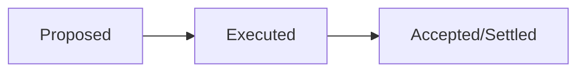
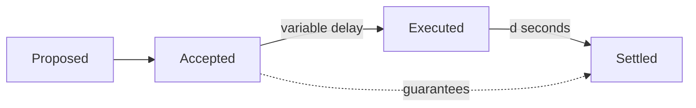
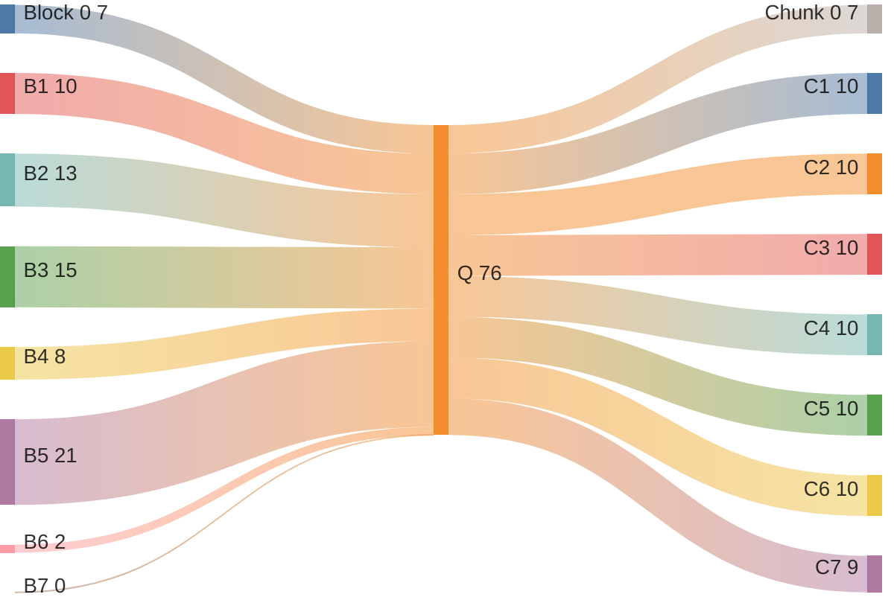

| ACP | 194 |
| :--- | :--- |
| **Title** | Streaming Asynchronous Execution |
| **Author(s)** | Arran Schlosberg ([@ARR4N](https://github.com/ARR4N)), Stephen Buttolph ([@StephenButtolph](https://github.com/StephenButtolph)) |
| **Status** | Proposed |
| **Track** | Standards |

## Abstract

Streaming Asynchronous Execution (SAE) decouples consensus and execution by introducing a queue upon which consensus is performed.
A concurrent execution stream is responsible for clearing the queue and reporting a delayed state root for recording by later rounds of consensus.
Validation of transactions to be pushed to the queue is lightweight but guarantees eventual execution.

## Motivation

### Performance improvements

1. Concurrent consensus and execution streams eliminate node context switching, reducing latency caused by each waiting on the other.
In particular, "VM time" (akin to CPU time) more closely aligns with wall time since it is no longer eroded by consensus.
This increases gas per wall-second even without an increase in gas per VM-second.
2. Lean, execution-only clients can rapidly execute the queue agreed upon by consensus, providing accelerated receipt issuance and state computation.
Without the need to compute state _roots_, such clients can eschew expensive Merkle data structures.
End users see expedited but identical transaction results.
3. Irregular stop-the-world events like database compaction are amortised over multiple blocks.
4. Introduces additional bursty throughput by eagerly accepting transactions, without a reduction in security guarantees.
5. Third-party accounting of non-data-dependent transactions, such as EOA-to-EOA transfers of value, can be performed prior to execution.

### Future features

Performing transaction execution after consensus sequencing allows the usage of consensus artifacts in execution. This unblocks some additional future improvements:

1. Exposing a real-time VRF during transaction execution.
2. Using an encrypted mempool to reduce front-running.

This ACP does not introduce these, but some form of asynchronous execution is required to correctly implement them.

### User stories

1. A sophisticated DeFi trader runs a highly optimised execution client, locally clearing the transaction queue well in advance of the network—setting the stage for HFT DeFi.
2. A custodial platform filters the queue for only those transactions sent to one of their EOAs, immediately crediting user balances.

## Description

In standard, synchronous, execution a block is first _proposed_ by a validator. In order for validators to consider the block valid to insert into the consensus process, it is _executed_. After _execution_, the block is _accepted_ by consensus. The act of _accepting_ a block immediately _settles_ all transactions in the block by including the transaction execution results.

Under SAE, a block is first _proposed_ by a validator. In order for validators to consider the block valid to insert into the consensus process, it is verified that later _execution_ will succeed. The block is then _accepted_ by consensus. The act of _accepting_ a block _enqueues_ the block to be _executed_. After the block is _executed_, a following block will reference the execution results and _settle_ all transactions in now _executed_ block.

### Block lifecycle

#### Proposing blocks

The validator selection mechanism for block production is unchanged. However, block builders are no longer expected to execute transactions during block building.

The block builder is expected to include transactions based on the most recently settled state and to apply worst-case bounds on the execution of the ancestor blocks prior to the most recently settled block.

The worst-case bounds enforce minimum balances of sender accounts and the maximum required base fee. The worst-case bounds are described below [in detail](#specification).

Prior to adding a proposed block to consensus, all validators MUST verify that the block builder correctly enforced the worst-case bounds while building the block. This guarantees that the block can be executed successfully if it is accepted.

> [!NOTE]
> The worst-case bounds guarantee does not provide assurance about whether or not a transaction will revert nor whether its computation will run out of gas by reaching the specified limit. The verification only ensures the transaction is capable of paying for the accrued fees.

#### Accepting blocks

Once a block is marked as accepted by consensus, the block is enqueued in a FIFO execution queue.

#### Executing blocks

There is a constantly alive block executor whose job is to execute blocks taken off the FIFO execution queue.

In addition to executing the blocks, the block executor provides deterministic timestamps for the beginning and end of execution of a block.

Time is accordingly measured in two ways by the block executor.

1. The timestamp included in the block header.
2. The amount of gas charged during the execution of blocks.

> [!NOTE]
> Execution timestamps are more granular than block header timestamps to allow sub-second block execution times.

As soon as there is a block available to execute on the execution queue, the block executor starts processing the block.

If the block executor's current timestamp is prior to the current block's timestamp, the block executor's timestamp is advanced to the block's timestamp.

The block is then executed on top of the last executed (not settled) state.

After executing the block, the block executor advances its timestamp based on the gas usage of the block.

The block's execution time is now timestamped and the block is available to be settled.

#### Settling blocks

Previously executed blocks are settled by the acceptance of a new block whose timestamp is greater than or equal to the execution time of a prior block plus a constant additional delay.

The additional delay amortises any spurious slowdowns the block executor may have encountered.

## Specification

### Background

ACP-103 introduced the following variables for calculating the gas price:

| | |
|---|---|
| $T$ | the target gas consumed per second |
| $M$ | minimum gas price |
| $K$ | gas price update constant |
| $R$ | gas capacity added per second |

ACP-176 provided a mechanism to make $T$ dynamic and set:

$$
\begin{align}
R &= 2 \cdot T \\
K &= 87 \cdot T
\end{align}
$$

The _excess_ actual consumption $x \ge 0$ beyond the target $T$ is tracked via numerical integration and used to calculate the gas price as:

$$M \cdot \exp\left(\frac{x}{K}\right)$$

### Gas charged

We introduce $g_L$, $g_U$, and $g_C$ as the gas _limit_, _used_, and _charged_ per transaction, respectively. We define

$$
g_C := \max\left(g_U, \frac{g_L}{\lambda}\right)
$$

where $\lambda$ enforces a lower bound on the gas charged based on the gas limit.

> [!NOTE]
> $\dfrac{g_L}{\lambda}$ is rounded up by actually calculating $\dfrac{g_L + \lambda - 1}{\lambda}$

In all cases that execution used to refer to gas usage, we will from now on consider gas charged. For example, the gas excess $x$ will be modified by $g_C$ rather than $g_U$.

### Queue size

The constant time delay between execution and settlement is defined as $\tau$ seconds.

The maximum allowed size of the execution queue is defined as:

$$
\omega ~:= R \cdot \tau \cdot \lambda
$$

Any block that could cause the total sum of gas limits for transactions in the execution queue to exceed $\omega$ MUST be considered invalid.

### Block executor

During the activation of SAE, the block executor's timestamp, $t_e$, is initialised to the timestamp of the last accepted block.

Prior to executing a block which includes timestamp $t_b$, the executor's timestamp and excess is updated:

$$
\begin{align}
\Delta{t} &~:= \max\left(t_e, t_b\right) - t_e \\
t_e &~:= t_e + \Delta{t} \\
x &~:= \max\left(x - T \cdot \Delta{t}, 0\right) \\
\end{align}
$$

The block is then executed with this gas price.

After executing a block which was charged $g_C$ gas, the executor's timestamp and excess is updated:

$$
\begin{align}
t_e &~:= t_e + \frac{g_C}{R} \\
x &~:= x + \frac{g_C}{2} \\
\end{align}
$$

$t_e$ is now this block's execution timestamp.

### Handling gas target changes

When a block is produced which modifies $T$, both the consensus thread and the execution thread will update to the modified $T$ after their own processing of the block.

For example, restrictions of the queue size MUST be calculated based on the parent block's $T$.

Similarly, the time spent executing a block MUST be calculated based on the parent block's $T$.

### Block settlement

For a _proposed_ block which includes timestamp $t_b$, all ancestors whose execution timestamp $t_e$ is $t_e + \tau \leq t_b$ are considered settled.

The _proposed_ block must include the `stateRoot` produced by the execution of the most recently settled block.

Similarly, it MUST record the transaction-receipt root for all transactions executed as part of chunks in the half-open range $t_C \in (t_{B-1} - d, t_B - d]$.

For any _newly_ settled blocks, the _proposed_ block must include all execution artifacts:
- `receiptsRoot`
- `logsBloom`
- `gasUsed`

> [!NOTE]
> If the block executor has fallen behind, the node may not be able to determine precisely which ancestors should be considered settled. If this occurs, validators MUST allow the block executor to catch up prior to deciding the block's validity.

### Block validity and building

After determining which blocks to settle, all remaining ancestors of the new block must be inspected to determine the worst-case bounds on $x$ and account balances. Account nonces are able to be known immediately.

The worst-case bound on $x$ can be calculated by following the block executor update rules using $g_L$ rather than $g_C$.

The worst-case bound on account balances can be calculated by charging the worst-case gas cost to the sender of a transaction along with deducting the value of the transaction from the sender's account balance.

## Backwards Compatibility

This ACP modifies the meaning of multiple fields in the block. A comprehensive list of changes will be produced once a reference implementation is available.

Likely fields to change include:
- `stateRoot`
- `receiptsRoot`
- `logsBloom`
- `gasUsed`
- `extraData`

## Reference Implementation

A reference implementation is still a work-in-progress. This ACP will be updated to include a reference implementation once one is available.

## Security Considerations

### Worst-case transaction validity

To avoid a DoS vulnerability on execution, we require an upper bound on transaction gas cost (i.e. amount $\times$ price).
Beyond regular requirements for transaction validity (e.g. nonce, signature, etc.) we therefore introduce "worst-case cost" validity.

Consider a hypothetical situation in which all enqueued transactions use their entire gas limit during execution.
We can prove that, for every transaction, this would result in the greatest possible:

1. Consumption of gas units (by definition of the gas limit); and
2. Gas excess $x$ (and therefore gas price) at the time of execution.

For a queue of transactions $Q = \\{i\\}_{i \ge 0}$ the gas excess $x_j$ immediately prior to execution of transaction $j \in Q$ is a monotonic, non-decreasing function of the gas usage of all preceding transactions in the queue; i.e. $x_j~:=~f(\\{g_i\\}_{i<j})$.

To see this, consider transaction $0 \le k<j$ consuming gas $g_k$.
A decrease in $g_k$ reduces the immediate increase of $x$.
Furthermore, this lowered consumption can never reduce a chunk's gas surplus and hence any decrease of $x$ is $\ge$ predicted.
The excess, and hence gas price, for every later transaction $x_{i>k}$ is therefore reduced:

$$
\downarrow g_k \implies
\begin{cases}
    \downarrow \frac{g \cdot (p-1)}{p} \\
    \uparrow \frac{s}{p}
\end{cases}
\implies \downarrow \Delta x_k
\implies \downarrow M \cdot \exp\left(\frac{x_{i>k}}{K}\right)
$$

Given maximal gas consumption under (1), the monotonicity of $f$ implies (2).

Since we are working with non-negative integers, it follows that multiplying a transaction's gas limit by the hypothetical gas price of (2) results in its worst-case gas cost.
Any sender able to pay for this upper bound (in addition to value transfers) is guaranteed to be able to pay for the actual execution cost.
Transaction _acceptance_ under worst-case cost validity is therefore a guarantee of _settlement_.

### Queue DoS protection

Worst-case cost validity only protects against DoS at the point of execution but leaves the queue vulnerable to high-limit, low-usage transactions.
For example, a malicious user could send a transfer-only transaction (21k gas) with a limit set to multiple chunks.
Although they would have to have sufficient funds to theoretically pay for all the chunks, they would never actually be charged this amount. Pushing a sufficient number of such transactions to the queue would artificially inflate the worst-case cost of other users.

Gas limits are typically set higher than expected gas used to allow for a buffer should gas estimates be imprecise.
A lower bound of 50% of the specified limit, for example, would allow for a 100% buffer on estimates without penalising the sender, while still disincentivising falsely high limits.

#### Upper bound on queue DoS

With $R$ (gas capacity per second) for rate and $g_C$ (gas charged) as already defined.

The actual gas excess $x_A$ has an upper bound of the worst-case excess $x_W$, both of which can be used to calculate respective base fees $f_A$ and $f_W$ (the variable element of gas prices) from the existing exponential function:

$$
f := M \cdot \exp\left( \frac{x}{K} \right).
$$

Mallory is attempting to maximize the DoS ratio

$$
D := \frac{f_W}{f_A}
$$

by maximizing $\Sigma_{\forall i} (g_L - g_U)_i$ to maximize $x_W - x_A$.

> [!TIP]
> Although $D$ shadows a variable in ACP-176, that one is very different to anything here so there won't be confusion.

Recall that the proportionality $p$ of capacity per second and target gas per second ($R = pT$) results in increasing excess such that

$$
x := x + \frac{g (p-1)}{p}.
$$

Since we limit the size of the queue to $\omega$, we can derive an upper bound on the difference in the changes to worst-case and actual gas excess:

$$
\begin{align}
\Delta x_A &\ge \lambda \cdot \omega \cdot \frac{p-1}{p} \\
\Delta x_W &= \omega \cdot \frac{p-1}{p} \\
\Delta x_W - \Delta x_A &\le (1-\lambda) \cdot \omega \cdot \frac{p-1}{p} \\
&= (1-\lambda) \cdot \frac{\tau R}{\lambda} \cdot \frac{p-1}{p} \\
&= \frac{1-\lambda}{\lambda} \cdot \tau \cdot p T \cdot \frac{p-1}{p} \\
&= \frac{1-\lambda}{\lambda} \cdot \tau \cdot T \cdot (p-1).
\end{align}
$$

Note that we can express Mallory's DoS quotient as:

$$
\begin{align}
D &= \frac{f_W}{f_A} \\
&= \frac{ M \cdot \exp \left( \frac{x_W}{K} \right)}{ M \cdot \exp \left( \frac{x_A}{K} \right)} \\
& = \exp \left( \frac{x_W - x_A}{K} \right).
\end{align}
$$

When the queue is empty (i.e. the execution stream has caught up with accepted transactions), the worst-case fee estimate $f_W$ is known to be the actual base fee $f_A$; i.e. $Q = \emptyset \implies D=1$. The previous bound on $\Delta x_W - \Delta x_A$ also bounds Mallory's ability such that:

$$
D \le \exp \left( \frac{\frac{1-\lambda}{\lambda} \cdot \tau \cdot T \cdot (p-1)}{K} \right).
$$

## Appendix

### JSON RPC methods

Although asynchronous execution decouples the transactions and receipts recorded by a specific block, APIs MUST NOT alter their behavior to mirror this.
In particular, the API method `eth_getBlockReceipts` MUST return the receipts corresponding to the block's transactions, not the receipts settled in the block.

#### Named blocks

The Ethereum Mainnet APIs allow for retrieving blocks by named parameters that the API server resolves based on their consensus mechanism.
Other than the _earliest_ (genesis) named block, which MUST be interpreted in the same manner, all other named blocks are mapped to SAE in terms of the execution status of blocks and MUST be interpreted as follows:

 * _pending_: the most recently _accepted_ block;
 * _latest_: the block that was most recently _executed_;
 * _safe_ and _finalized_: the block that was most recently _settled_.

> [!NOTE]
> The finality guarantees of Snowman consensus remove any distinction between _safe_ and _finalized_. 
> Furthermore, the _latest_ block is not at risk of re-org, only of a negligible risk of data corruption local to the API node.

### Alternative framing of chunk filling

The criteria for chunk filling define an online algorithm that is equivalent to this offline perspective.

Consider a queue for which actual gas consumption is known for all transactions, and said consumption exceeds the chain capacity so the queue is never exhausted.
Filling can now be viewed as an allocation problem, selecting a deterministic chunk for each transaction.
As each round of consensus is required to record a specific chunk, no theoretical chunk can end earlier than any of its assigned transactions.
A transaction is therefore allocated to the theoretical chunk during which its execution completes.

> [!TIP]
> As chunk capacity is measured in terms of a gas _rate_, time and gas can be thought of interchangeably along the x-axis.
> Chunks are 1-indexed to reflect the time at which they end.

```mermaid
---
displayMode: compact
---
gantt
    title Theoretical chunks
    dateFormat  x
    axisFormat %S
    tickInterval 1second
    section Chunks
    c1  :c1, 0, 1s
    c2  :c2, after c1, 1s
    c3  :c3, after c2, 1s
    c4  :c4, after c3, 1s
    c5  :c5, after c4, 1s
    c6  :c6, after c5, 1s
    section Transactions
    t0  :t0, 0, 0.4s
    t1  :t1, after t0, 0.4s
    t2  :t2, after t1, 0.4s
    t3  :t3, after t2, 0.8s
    t4  :t4, after t3, 0.9s
    t5  :t5, after t4, 2s
    t6  :t6, after t5, 1.1s
    section Donations
    c1->c2  : 800, 0.2s
    c3->c4  : 2900, 0.1s
    c4->c5  : 2900, 1.1s
    c5->c6  : 4900, 0.1s
```

1. Total gas used by transactions `t0` and `t1` is less than a single chunk so they are allocated to `c1`.
2. Addition of `t2` would exceed `c1` capacity so it is instead allocated to `c2`.
3. Note the necessary "donation" of `c1`'s residual capacity to `c2`, allowing for allocation of `t3` as well.
4. Transaction `t4` is the only one that can fit into chunk `c3`.
5. The large transaction `t5` requires more than a single chunk of gas, resulting in `c4` being an empty _interim_ chunk and the allocation of `t5` to `c5`.
    1. The residual of `c3` was first donated to `c4`, which was unable to fit the next transaction, resulting in transitive donation to `c5`.
6. Even with its double donation, `c5` no longer has sufficient capacity for the final transaction `t6`, which is in `c6`.

Note that the donation-adjusted chunks fully utilise chain capacity while also completing execution no later than their respective timestamps, which would otherwise be detrimental to consensus.

```mermaid
---
displayMode: compact
---
gantt
    title Donation-adjusted chunks
    dateFormat x
    axisFormat %S
    tickInterval 1second
    section Chunks
    c1  :a1, 0, 0.8s
    c2  :a2, after a1, 1.2s
    c3  :a3, after a2, 0.9s
    c5  :a5, after a3, 2s
    c6  :a6, after a5, 1.1s
    section Transactions
    t0  :t0, 0, 0.4s
    t1  :t1, after t0, 0.4s
    t2  :t2, after t1, 0.4s
    t3  :t3, after t2, 0.8s
    t4  :t4, after t3, 0.9s
    t5  :t5, after t4, 2s
    t6  :t6, after t5, 1.1s
```

### Streaming vs regular asynchronous pipelining

### Observations around transaction prioritisation

As EOA-to-EOA transfers of value are entirely guaranteed upon _acceptance_, block builders MAY choose to prioritise other transactions for earlier execution.

A reliable marker of such transactions is a gas limit of 21,000 as this is an indication from the sender that they do not intend to execute bytecode.

This could delay the ability to issue transactions that depend on these EOA-to-EOA transfers.

Block builders are free to make their own decisions around which transactions to include.

## Acknowledgments

Thank you to the following non-exhaustive list of individuals for input, discussion, and feedback on this ACP.

* [Aaron Buchwald](https://github.com/aaronbuchwald)
* [Angharad Thomas](https://x.com/divergenceharri)
* [Meaghan FitzGerald](https://github.com/meaghanfitzgerald)
* [Michael Kaplan](https://github.com/michaelkaplan13)
* [Yacov Manevich](https://github.com/yacovm)

## Copyright

Copyright and related rights waived via [CC0](https://creativecommons.org/publicdomain/zero/1.0/).
